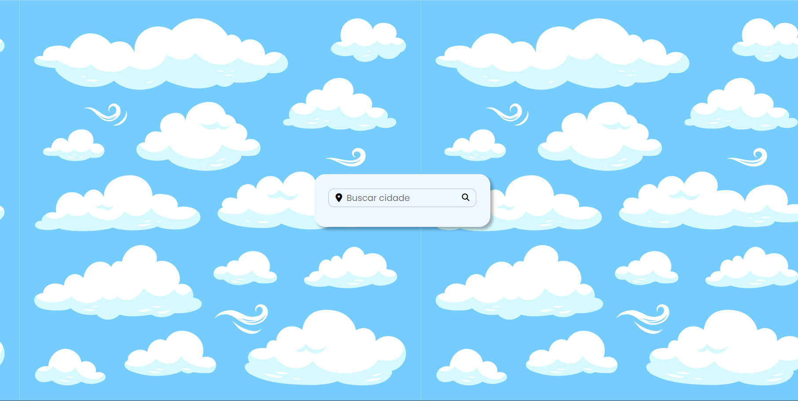
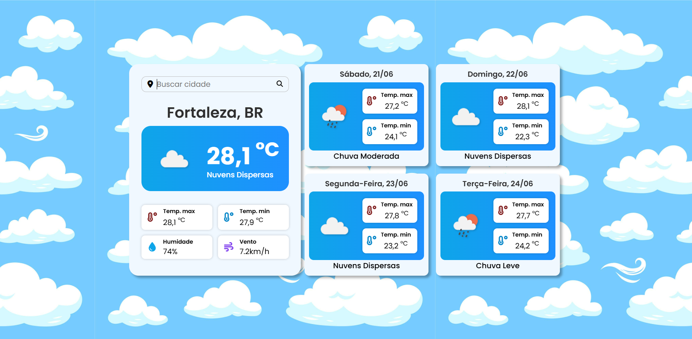

# 🌤️ Weather App - Previsão do Tempo

Aplicação web que exibe a **previsão do tempo atual e dos próximos dias**, com uma interface moderna, animações suaves e visual totalmente responsivo. Desenvolvido com foco em praticar consumo de APIs, manipulação de DOM e organização de código em projetos front-end.

<div align="center">
  
  
</div>

---

## 🚀 Tecnologias Utilizadas

- **HTML5**, **CSS3**, **JavaScript (ES6+)**;
- **Vite** – para bundling e ambiente de desenvolvimento rápido;
- **OpenWeather API** – dados meteorológicos em tempo real;
- **Font Awesome** – ícones;
- **Google Fonts (Poppins)** – tipografia;
- **.env** – segurança da chave de API;
- **Animações CSS** – plano de fundo com movimento fluido.

---

## 📦 Instalação e Execução

```bash
# Clone o repositório
git clone https://github.com/islaianeribeiro/weather-forecast

# Acesse a pasta
cd weather-forecast

# Instale as dependências
npm install

# Crie o arquivo .env na raiz e adicione sua chave da API:
VITE_API_KEY=sua_chave_aqui

# Execute a aplicação
npm run dev
```

---

## 🌍 Funcionalidades

- Pesquisa de cidade e exibição do clima atual;
- Temperatura atual, máxima e mínima;
- Umidade e velocidade do vento;
- Ícone e descrição das condições climáticas;
- Previsão para os **próximos 4 dias** mostrando temperatura máxima e mínima;
- Layout responsivo e acessível;
- Alertas visuais para erros ou cidade não encontrada.

---

## 🧠 Organização do Código

Estrutura das pastas e arquivos do projeto:

```
📁 public                  # Ícones e imagens utilizadas no projeto
📁 src
├─ 📁 api
│  └─ 📄 api.js            # Funções responsáveis pelas chamadas à API (clima e previsão)
├─ 📁 utils
│  └─ 📄 formatters.js     # Funções auxiliares para formatar os dados da API
├─ 📁 ui
│  └─ 📄 ui.js             # Funções que manipulam e atualizam a interface do usuário
├─ 📄 main.js              # Script principal: controla eventos, validações e integra tudo
├─ 📄 styles.css           # Estilos gerais do site + animações visuais
│
📄 index.html              # Estrutura HTML principal da aplicação

```

---

## ✨ Extras Visuais

- Animação de nuvens no fundo com CSS puro;
- Imagens para feedback de erro (ex: cidade não encontrada);
- Estilo com cores suaves e foco na legibilidade.

---

## 🔐 Segurança

A chave da API foi movida para o arquivo `.env` e consumida via `import.meta.env.VITE_API_KEY` para manter o projeto mais seguro em ambientes públicos.

✅ **Importante**: o `.env` está incluso no `.gitignore` para evitar vazamento da chave.

---

## 📸 Demonstração

Você pode ver a demonstração visual do projeto nas imagens abaixo:

<div align="center">
  
  
</div>

---

## 📌 Status do Projeto

- ✔️ Projeto finalizado e publicado;
- 🔧 Possível migração futura para React;
- 🌐 Publicado via \ [Vercel](https://weather-forecast-app-islaianeribeiro.vercel.app/).

---

## 👩‍💻 Desenvolvido por

**Islaiane Ribeiro**
Front-End Developer

🔗 [https://www.linkedin.com/in/islaianeribeiro](https://www.linkedin.com/in/islaianeribeiro)

---

## 📝 Licença

MIT © 2025 — Sinta-se à vontade para usar como base para seus próprios projetos!
